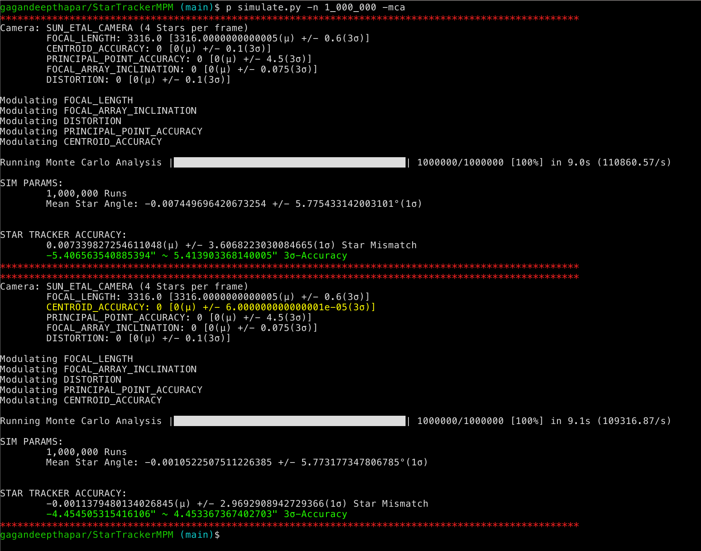
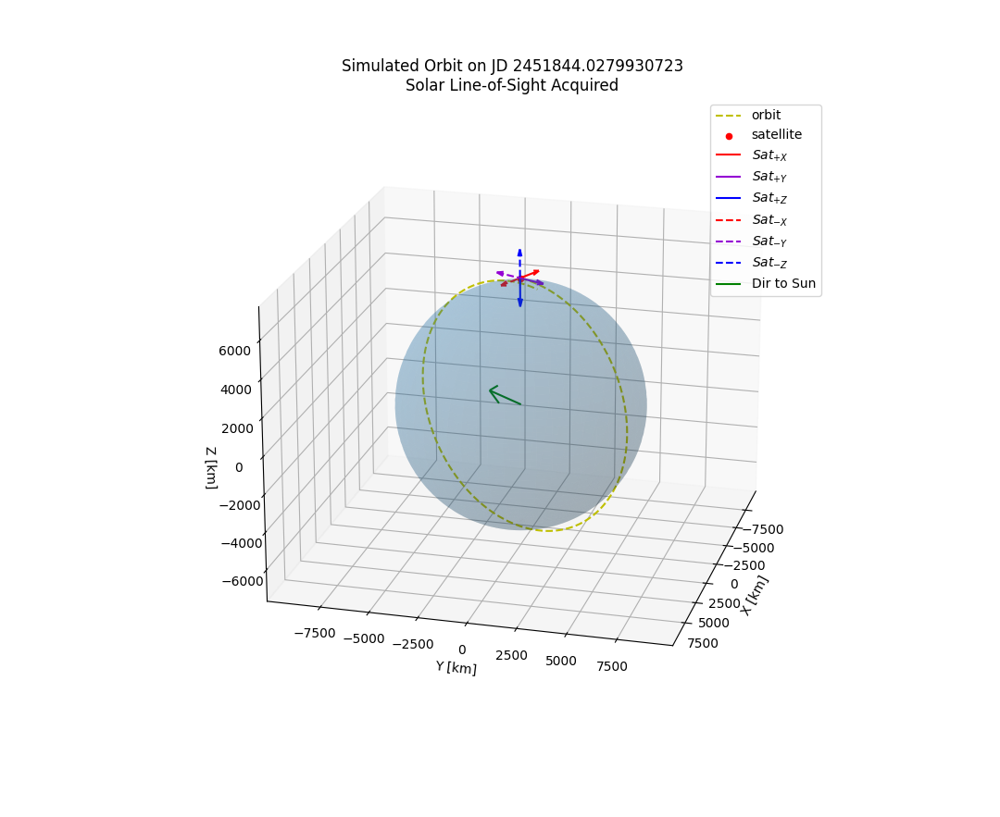
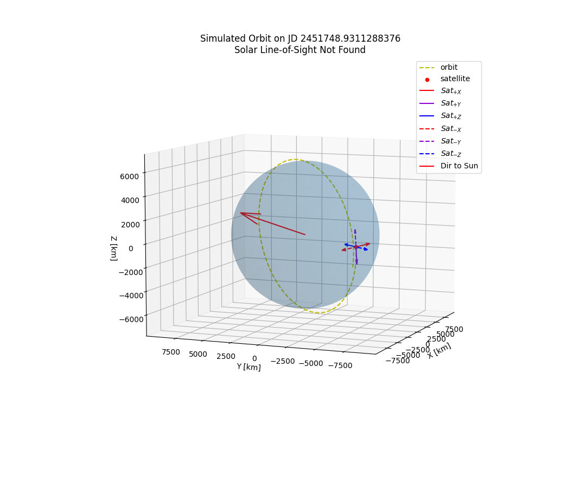
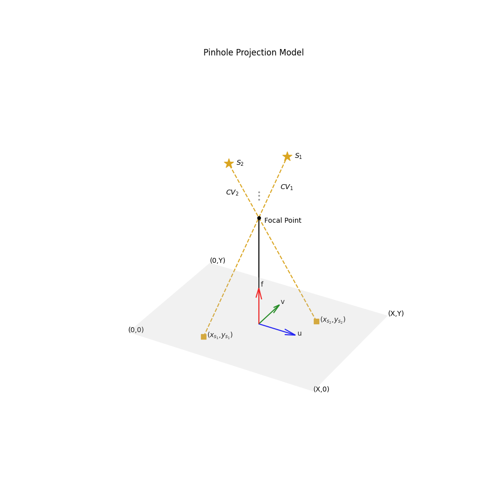
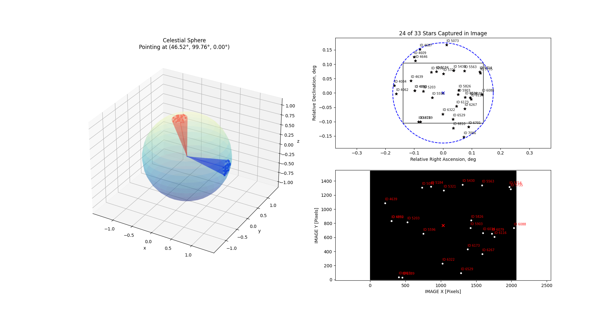

# Star Tracker Measurement Process Model (STMPM)
**A Robust Model for Measuring Accuracy and Precision of LEO-Based Star Trackers: An Analysis of Disturbance Propagation**

## Considerations
Several factors need to be considered to accurately determine the measurement accuracy and precision of a star tracker in orbit. A few of the considerations are listed below

### Hardware
- Focal Length Deviation
- Focal Array Tilt
- Radial Distortion
- Principal Point Deviation
- Baffle (WIP)

### Software
- Centroiding Accuracy
- Noise Minimization (WIP)

### Environment
- Temperature Change/Cycling (WIP)
- Radiation  (WIP)
- Atomic Oxygen (WIP)

## Usage
A few examples of how the tool can be used are listed below

#### **Improved Centroiding Effect**
In *Optical System Error Analysis and Calibration Method of High-Accuracy Star Trackers*, Sun et al., the expected centroiding accuracy used for Monte Carlo Analysis was set to 0.1 pixels (3-sigma). Since publication, several centroiding algorithms and approaches have been developed and have vastly improved. In *A Novel Systematic Error Compensation Algorithm Based on Least Squares Support Vector Regression for Star Sensor Image Centroid Estimation*, Yang et al., a method was proposed bringing the expected centroid error to 6e-5 pixels! Using the STMPM, we can see that the expected star tracker accuracy improvement solely due to the new centroiding algorithm is improved by 1 arcsecond! The results were achieved using Monte Carlo Analysis with the derived model. It should be noted that Sun et al. uses a single incident angle whereas the STMPM uses a uniformly random incident angle within +/- 10 degrees.

#### **Environmental Effects**
The environment of space will create disturbances in the Star Tracker Measurement Process Model. These effects are coupled to the orbit the satellite resides within; to properly estimate how an orbit affects measurement accuracy and precision, an orbit needs to be randomly generated. The `Orbit` class represents an orbit that can be *randomized* within the distribution modeled after the orbits currently occupied by active CubeSats (and LEO satellites, in general). This was accomplished by reading in data from [CelesTrak](https://celestrak.org/) and transforming the data to a normal distribution which can be sampled (and reverse-transformed). The orbit can be plotted in matplotlib where the satellite and its body reference frame are plotted alongside the directional vector pointing to the Sun's location (based on a randomly generated Julian Date). The position of the sun and the attitude of the satellite (assumed to be nadir-pointing) directly influence the effect of temperature on the system, more specifically the focal length and optical distortion. The plot is a visualization method of the satellite's position relative to Earth and the Sun.

#### **Software Effects**
One of the major components of star tracker accuracy and precision is the software embedded in the hardware. [QUEST](https://en.wikipedia.org/wiki/Quaternion_estimator_algorithm) and [Davenport's q-Method](https://ntrs.nasa.gov/citations/19680021122) are popular methods in extracting the attitude of the satellite from a star tracker. These methods require a set of vectors in the body frame (e.g., the camera frame) and their inertial counterpart to calculate the attitude transformation of the boresight of the star tracker (e.g., via Directional Cosine/Rotation Matrix or Quaternion). The `Projection` dataclass contains information for generating a list of random X/Y coordinate pairs that lie on a given camera focal array. ECI and Camera Vectors are then generated using the pinhole projection which can be used to analyze various software affects (e.g., affect of centroiding accuracy on attitude determination).

A visualization of the inertial and relative vectors are shown below; the red cone shows the inertial attitude of the camera and the blue cone shows the camera rotation projection on the X-axis. A maximum star magnitude of 6 was used.

